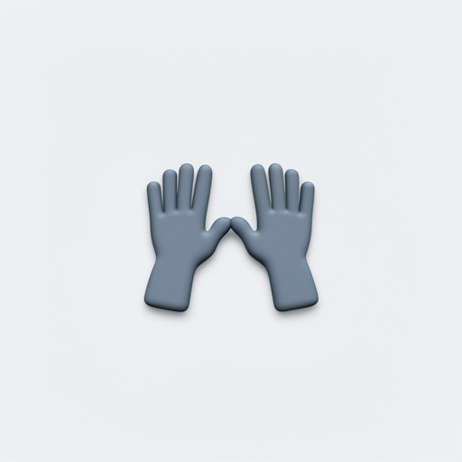
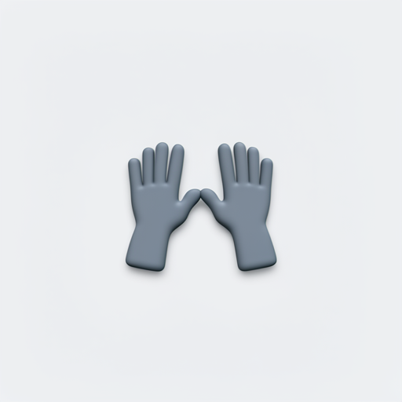
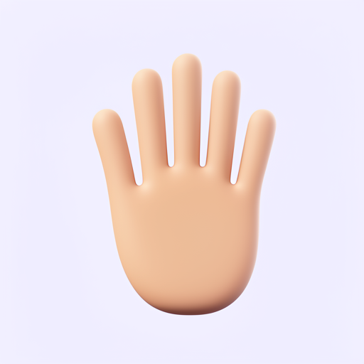
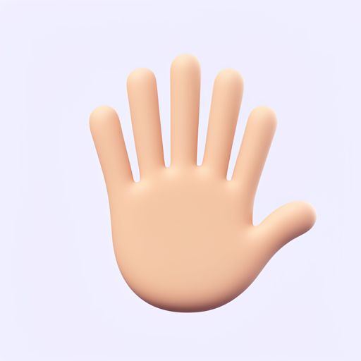

# High-five baseline: September 24–25, 2026

All 32 planned images completed and passed local checksum verification. No new
optimizer steps were run. This experiment measures the starting point for
interaction training; it does not demonstrate that high-five generation is solved.

## Locked comparison

- Model: `black-forest-labs/FLUX.2-klein-base-4B`, revision
  `a3b4f4849157f664bdbc776fd7453c2783562f4d`.
- Adapted condition: the existing step-25 object/style LoRA, SHA-256
  `2c7b15de79e9ac0bf59488068c9ec0f3444dec44899005499de87c2b28e93076`.
- Eight frozen development prompts: four high-five requests and four nearby controls.
- Seeds 17 and 29, 512 pixels, 50 steps, guidance 4.0, identical serving style suffix.
- Two model conditions, giving 32 images and 16 matched pairs.
- Plan hash: `fec9e03614bacd62c5db3d4b92da3f4b02d0d2fb0b8e8d59529f045d0b50bd8f`.

The model and adapter were loaded in a separate evaluation process on the existing
RTX PRO 5000 Blackwell session. No additional GPU was provisioned. Recorded image
generation time totaled 455.70 seconds: 223.47 for the base and 232.23 for the
adapter. This excludes setup, transfer and idle time and is not an end-to-end cost.

## Preliminary visual findings

These are unblinded **AI observations**, not a completed human evaluation or a
statistical estimate of general capability. No high-five sample was an unambiguous
pass in either condition (eight high-five images per condition). The side-view and
impact-burst seed-29 examples are ambiguous and should receive human judgment;
they must not be silently counted as successes.

| Request | Observation in the matched conditions |
| --- | --- |
| Open palms, seed 17 | Two front-facing hands touch at their thumbs; palms do not meet. |
| Open palms, seed 29 | Fingertips/thumbs meet around a gap between the palms. |
| Opposite sides with impact burst | Seed 17 contacts at fingertips; seed 29 remains ambiguous with folded hands. |
| Different skin tones | Both seeds remain folded-hands-like and lack a clear tone contrast. |
| Side-view silhouette | Seed 17 touches thumbs; seed 29 leaves a gap and remains ambiguous. |
| Raised hand control | Seed 17 has four digits in both conditions. Adapted seed 29 has six digits. |
| Clapping control | Both seeds show hands side by side, without the required depth/contact relation. |

The handshake and folded-hands images are available for detailed human scoring;
recognizing their broad gesture alone does not certify finger anatomy.

### Representative generated evidence

| Base: thumb contact | Step 25: thumb contact |
| --- | --- |
|  |  |

| Base: raised-hand control, seed 29 | Step 25: six-digit regression, seed 29 |
| --- | --- |
|  |  |

These are actual Klein outputs. The separate imagegen reference candidates are not
outputs of the trained model and are not used in this comparison.

## Data work

`configs/high-five-curation.json` records four MIT-licensed Fluent controls, with
new captions tied to the visible artwork. All four were AI-inspected at native
256 pixels, 64 pixels and 32 pixels; native-resolution limitations remain explicit.
There are currently **zero accepted positive high-five training examples**.

An instructive metadata issue: the pinned Fluent `Folded hands` asset includes
`high 5` and `high five` among its keywords. These search aliases are not evidence
that the picture depicts the interaction we want to teach. Its new caption remains
folded hands, and it is included only as that control.

Two built-in imagegen candidates were saved locally. The first was rejected for
unverifiable rear-hand anatomy. The edited candidate improves finger visibility but
is pending human review and source permission verification. They share one pose
lineage and cannot count as independent train/validation examples. The tool did
not expose its underlying model version; that field remains null rather than guessed.

The data check requires 24 accepted training positives across at least eight pose
groups, eight validation positives across at least four disjoint pose groups,
light/medium/dark coverage, and the four neighboring controls. These are pilot
design requirements, not an established sufficient dataset size. It rejects stale
reviews, missing permissions, exact duplicate image files, split leakage and frozen evaluation
images/prompts. It validates recorded judgments; it cannot establish anatomy or
legal permissions automatically.

OpenAI's [published terms](https://openai.com/policies/terms-of-use/) include
restrictions on using outputs to develop competing models. Output ownership alone
does not establish permission for this training use. We have not established which
agreement or permission covers the built-in candidates, so they remain excluded.
Licensed/commissioned artwork or a separately verified synthetic source is needed.

## Reproduction and review

```sh
uv run python scripts/evaluate_interactions.py plan
# Run only on an appropriately budgeted existing CUDA machine:
uv run python scripts/evaluate_interactions.py run --max-seconds 1200
uv run python scripts/evaluate_interactions.py verify
uv run python scripts/build_interaction_review.py
uv run python scripts/prepare_interactions.py
```

The last command currently exits 1, correctly: positives and their pose/tone
coverage are missing. A passing data check would not itself launch training.

Local artifacts are in `runs/high-five-baseline-v1/`: immutable `plan.json`, complete
`report.json`, all 32 PNGs, an unblinded `review.html` showing 32/64-pixel previews,
and a blank `human-review-template.json`. Model weights and private manual-test
history are excluded from Git. Four representative baseline PNGs are published above.

## Session cost and cleanup

The pre-existing manual-test session shared a $3 cap and a four-hour deadline.
Its recorded starting credit was $9.7457911354; credit observed on September 25
was $6.1884668369. The **whole-session observed decrease is $3.5573242985**, about
$0.56 over the intended cap, subject to provider accounting lag. This includes
manual testing, setup and idle time; it must not be attributed solely to this baseline.

The watchdog recorded successful destruction **3,570.03 seconds (59.50 minutes)
after the deadline**. Its log contains a connection error, but does not establish
the full cause of the delay. The local watchdog did not deliver the promised timing
bound. A live `/v1/instances/` query on September 25 returned zero instances.
The deprecated `/v0/instances/` list endpoint returned 410; the existing alpha
launcher already uses v1 for that list operation.

All 32 baseline images were downloaded and verified. The prior manual-test `var/`
directory was also copied into private local artifacts before teardown. Do not
restart paid compute until the data source and next bounded run are concrete, and
address watchdog reliability before relying on another unattended cost cap.
